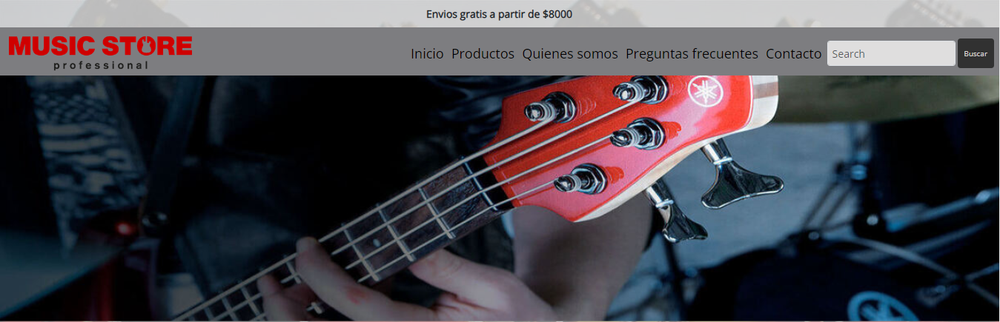

# 🎸 Music Store 🎸

## 🎼 Acerca de Music store 🎼
---
Music Store es un sitio de ventas de instrumentos musicales, donde se pueden encontrar gran variedad de marcas y estilos.

## 🎤 Acerca de mi 🎤
---
Soy Matias Rodriguez, estudio la carrera de desarrollador web y React en Coderhouse. Acabo de finalizar el curso de desarrollador Front End.

## 🌐 Mis redes 🌐
---
  

## 💻 Instalación 💻
---
Para poder usar este proyecto tenes que hacer lo siguiente:
- Debes clonar este repositrio con el siguiente comando: `git clone https://github.com/Matias-Rod/PreEntrega2-Rodriguez.git`
- Accedé a la carpeta del proyecto clonado con el siguiente comando: `cd *nombre del proyecto*`
- Debes instalar las dependencias necesarias con el siguieente comando: `npm install`

## 📚 Tecnologias usadas 📚
| En este proyecto se utlizaron las siguientes herramientas |/|
|-------------------|----------------------------------|
|HTML 5|
|CSS3| 
|GIT|
|BOOTSTRAP| 
|SASS|

## 🔸Links del Proyecto🔸
A continuación les dejo los links, tanto del repositorio en Github como los deployments:
- Link del repositorio: https://github.com/Matias-Rod/PreEntrega2-Rodriguez.git
- Link del deployment de Github: https://matias-rod.github.io/PreEntrega2-Rodriguez/
- Link del deployment en Netlify: https://master--bejewelled-pastelito-ecdfcb.netlify.app